# Pipeline de données streaming temps réel – IoT Smart Building (Kafka, Spark Streaming, S3 Datalake, FastAPI)

---

## 📊 Données utilisées

- Issues du *Smart Building System Dataset* (UC Berkeley).  
- 255 capteurs IoT réparties sur 51 salles (5 capteurs/room).  
- 5 types de capteurs : température, humidité, CO₂, luminosité, mouvement PIR.  
- Fréquence d’échantillonnage : 5 à 10 secondes selon le capteur.  
- Période couverte : 23 au 31 août 2013.

**Source du dateset :**  
https://www.kaggle.com/datasets/mdelfavero/smart-building-system

---

## 🧬 Description pipeline :

- Le producer lit automatiquement les CSV stockés sur une couche /raw d’un data lake AWS S3, rejoue les mesures en flux continu, puis les envoie dans les topics Kafka. Le script de replay (producer) offre le choix entre deux modes : soit un débit fixe (rate), soit le respect des intervalles réels du dataset (timewarp), ce mode simulant le comportement réel des capteurs. Les paramètres des modes sont modifiables depuis le fichier .env.
- Le consumer Spark streaming lit les messages depuis les topics Kafka ,en format Json, et les écrit en format parquet sur la couche bronze. Les données sont partitionnées par (date, room et type de capteur. Un checkpoint garantit la reprise du streaming en cas des pannes.
- Un premier job spark " micro batch" enrichit les données Bronze (room, sensor, qualité), calcule event_date et les écrit en Parquet. Le résultat est une couche Silver propre, partitioné par date , rapide et prete pour l'analyse.
- Un deuxième job Spark "batch" agrège les données Silver en KPIs horaires et journalières par room, et les sauvegarde en tables Parquet prêtes à l’usage sur la couche Gold. Airflow  l'exécution de ce job quotidiennement.
- Une API "FastApi" expose les données Silver du datalake S3 via des endpoints permettant de filtrer mesures et métadonnées. Elle offre un accès rapide aux lectures nettoyées par date, room et type de capteur. C’est la couche d’accès technique aux données brutes enrichies.
---

## 🏗️ Architecture globale du pipeline

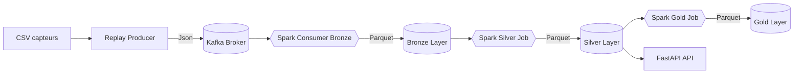
---

## Captures d’écran

[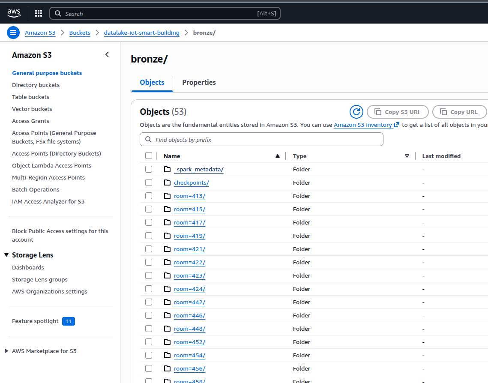](docs/screenshots/s3-1.png)
[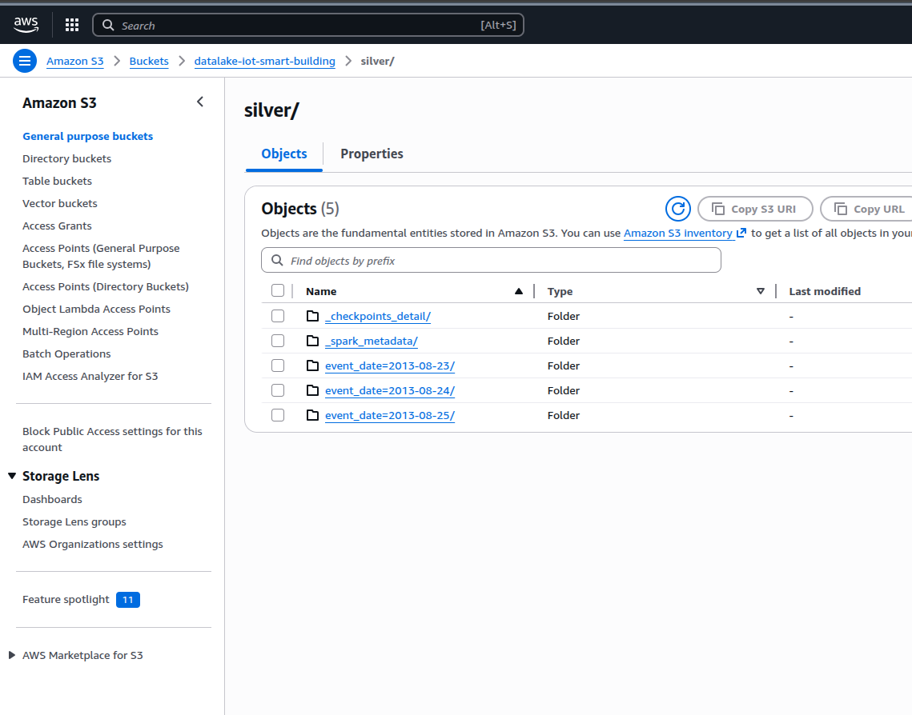](docs/screenshots/s3-2.png)
[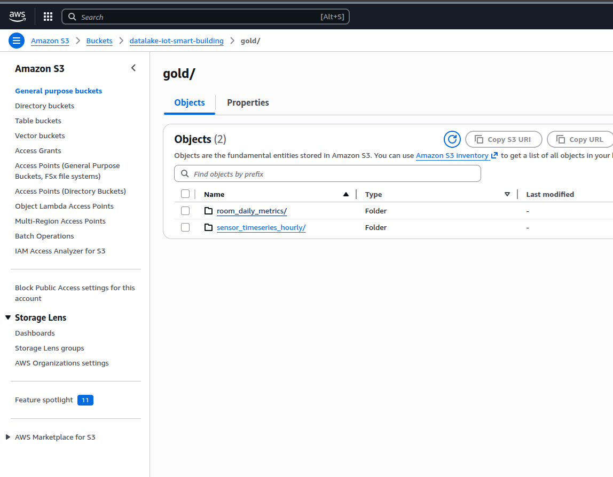](docs/screenshots/s3-4.png)

[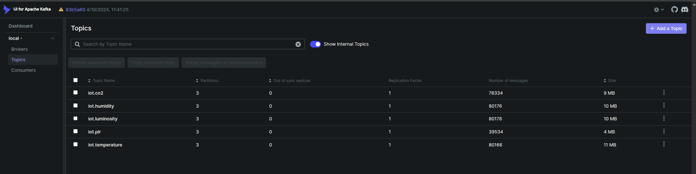](docs/screenshots/kafka-brocker.png)

[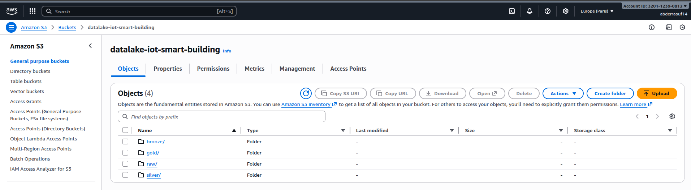](docs/screenshots/s3.png)
[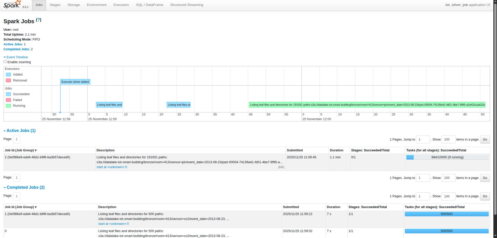](docs/screenshots/saprk.png)
[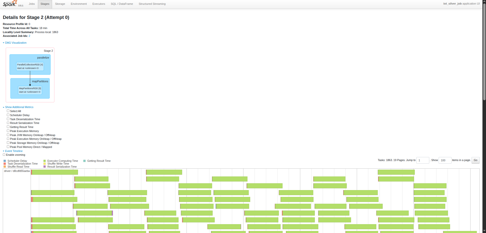](docs/screenshots/spark_2.png)

[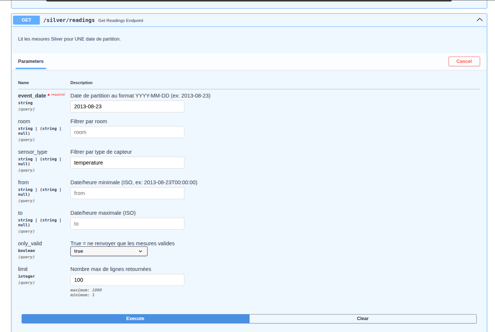](docs/screenshots/api-1.png)
[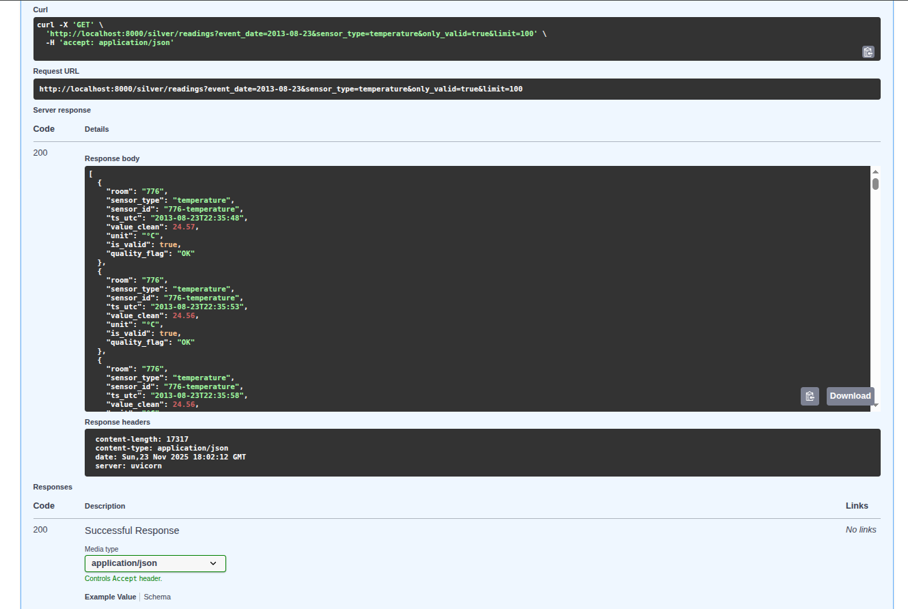](docs/screenshots/api-3.png)
[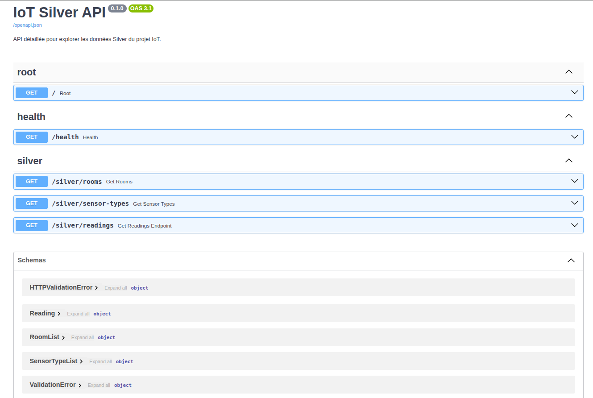](docs/screenshots/api.png)

[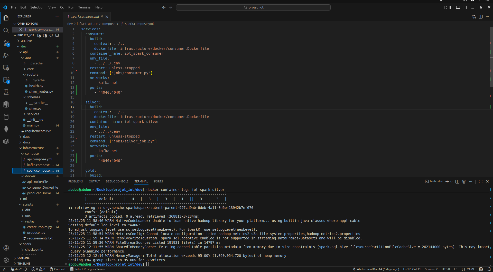](docs/screenshots/vscode.png)

---
## 👨‍💻 Auteur

**Abderraouf Boukarma**  

📧 **Email :** [boukarmaabderraouf@gmail.com](mailto:boukarma.abderraouf@gmail.com)  
🌐 **LinkedIn :** [linkedin.com/in/abderraouf-boukarma](https://www.linkedin.com/in/abderraouf-boukarma)  
💻 **GitHub :** [github.com/AbderraoufBou14](https://github.com/AbderraoufBou14)
