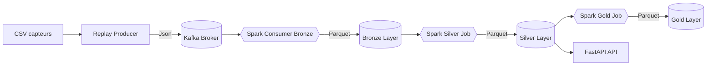

# Pipeline de données streaming temps réel – IoT Smart Building (Kafka, Spark Streaming, S3 Datalake, FastAPI)

---

## 📊 Données utilisées

- Issues du *Smart Building System Dataset* (UC Berkeley).  
- 255 séries temporelles provenant de capteurs IoT dans 51 salles.  
- 5 types de mesures : température, humidité, CO₂, luminosité, mouvement PIR.  
- Fréquence d’échantillonnage : 5 à 10 secondes selon le capteur.  
- Période couverte : 23 au 31 août 2013.

**Source Kaggle :**  
https://www.kaggle.com/datasets/mdelfavero/smart-building-system

---

## 🧬 Description pipeline :

- Le producer lit automatiquement les CSV S3 de chaque capteur et room, rejoue les mesures en flux continu, puis les envoie dans les topics Kafka en respectant soit un débit fixe (rate), soit les intervalles réels du dataset (timewarp), parametres a modifer depuis le .env
- Le consumer Spark streaming lit les messages Kafka en Json et les écrit en format parquet sur la couche bronze, partitionnée par (date, room et type de capteur. Un checkpoint garantit la reprise du streaming en cas des pannes.
- Un premier job spark enrichit les données Bronze (room, sensor, qualité), calcule event_date et les écrit en Parquet. Le résultat est une couche Silver propre, partitioné par date , rapide et prete pour l'analyse.
- Un deuxième job Spark agrège les données Silver en KPIs horaires et journalières par room, et les sauvegarde en tables Parquet prêtes à l’usage sur la couche Gold. Airflow orchestre son exécution quotidienne.
---

## 🏗️ Architecture globale du pipeline

---

## Captures d’écran

---
## 👨‍💻 Auteur

**Abderraouf Boukarma**  

📧 **Email :** [boukarmaabderraouf@gmail.com](mailto:boukarma.abderraouf@gmail.com)  
🌐 **LinkedIn :** [linkedin.com/in/abderraouf-boukarma](https://www.linkedin.com/in/abderraouf-boukarma)  
💻 **GitHub :** [github.com/AbderraoufBou14](https://github.com/AbderraoufBou14)
